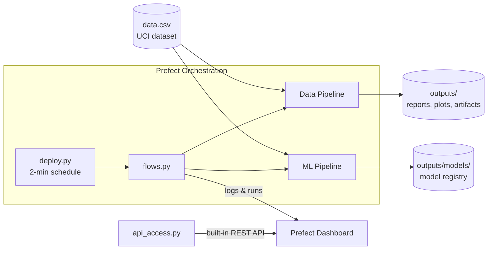
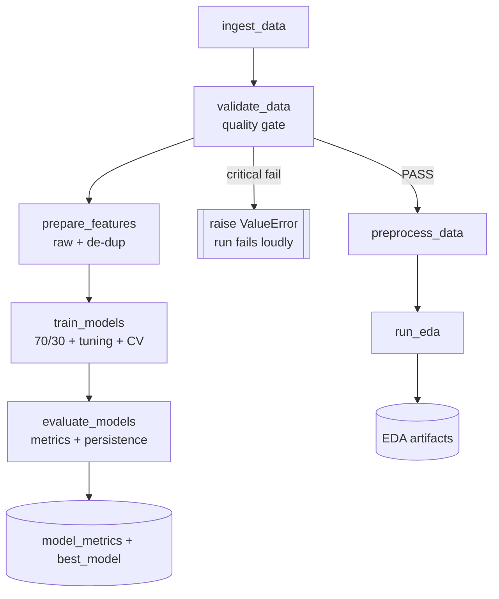
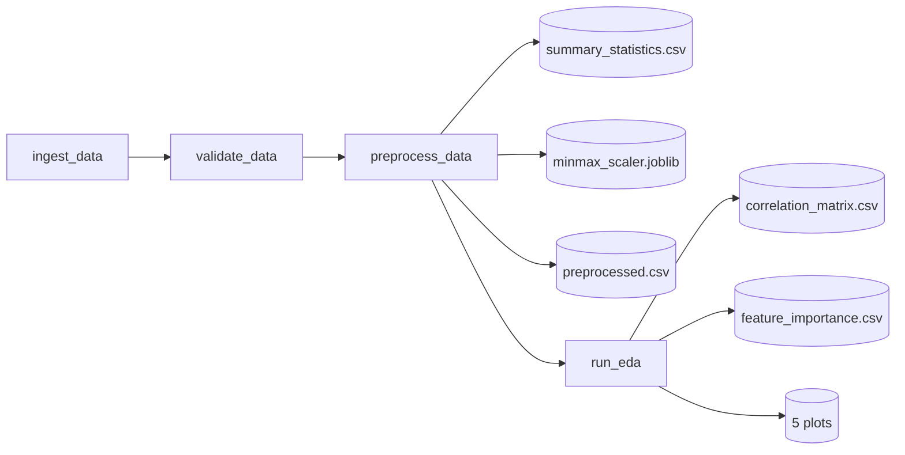
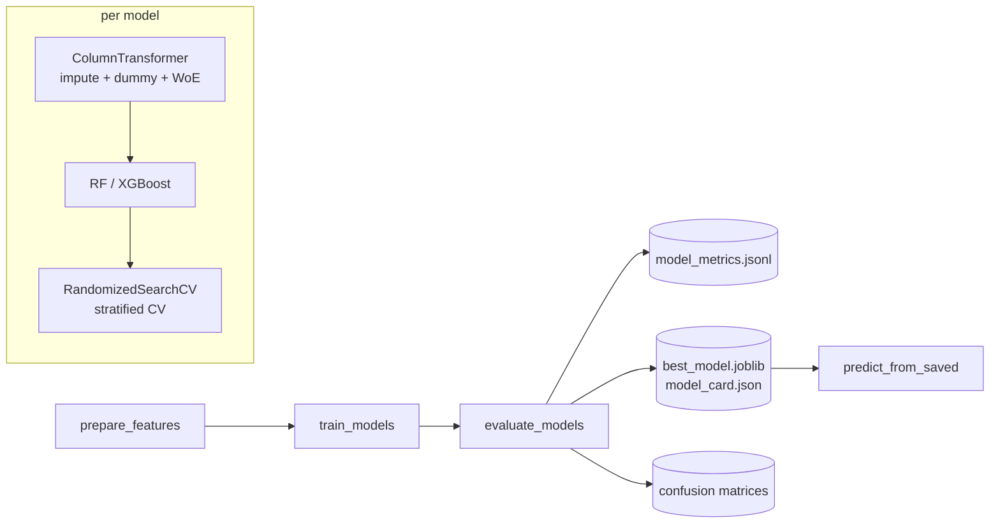
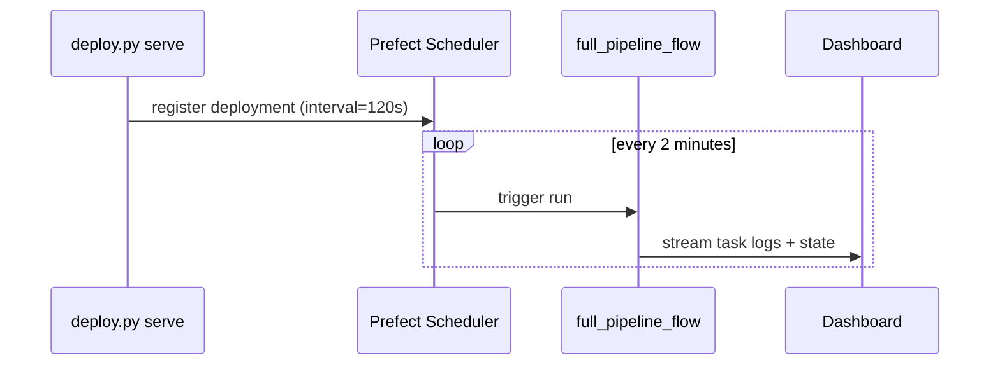

# Code Flow & Architecture

This document explains how the project executes, end to end — from raw CSV to a
scheduled, monitored, API-accessible cloud-native ML application.

## 1. Module map

| File | Responsibility |
| --- | --- |
| [config.py](config.py) | Central paths, dataset schema, continuous vs categorical column lists, ML settings, schedule interval. |
| [data_pipeline.py](data_pipeline.py) | Sub-Objective 1 — ingest, **validate**, preprocess, EDA. |
| [ml_pipeline.py](ml_pipeline.py) | Sub-Objective 2 — feature prep, tuned training, evaluation, model registry. |
| [flows.py](flows.py) | Prefect tasks + flows that orchestrate the two pipelines (DataOps/MLOps). |
| [deploy.py](deploy.py) | Registers deployments on a 2-minute schedule and serves them. |
| [api_access.py](api_access.py) | Sub-Objective 3 — reads app details via Prefect's built-in REST API. |
| [generate_report.py](generate_report.py) | Builds the Word submission report from generated artifacts. |

Everything is **logger-injectable**: each pipeline function accepts an optional
`logger`, so the same code runs from the CLI (standard logging) and inside
Prefect tasks (dashboard logging) without change.

## 2. High-level architecture

## 3. End-to-end execution flow

Note the two branches after validation:
- **Data branch** (`preprocess_data` → `run_eda`) produces cleaned data + EDA for
  analysis and the dashboard.
- **ML branch** (`prepare_features` → `train_models`) works on the **raw** data and
  does its own imputation/scaling *inside* the model pipeline — this prevents
  test-set leakage.

## 4. Data pipeline (Sub-Objective 1)

Entry point: `python data_pipeline.py` → runs ingest → validate → preprocess → EDA.

1. **`ingest_data`** — reads the semicolon-delimited CSV, strips whitespace from
   headers. Result: 4,424 × 37 DataFrame.
2. **`validate_data`** (quality gate) — checks target presence, feature count,
   min rows, duplicates, class balance, and IQR outliers. Writes
   `outputs/reports/data_quality_report.json`; raises on critical failures.
3. **`preprocess_data`**
   - Summary statistics → `summary_statistics.csv`
   - Data-type breakdown (logged)
   - De-duplication
   - Typed imputation: **median** for the 18 continuous columns, **mode** for
     categorical codes
   - **Min-Max normalization** of continuous columns only; the fitted scaler is
     saved to `artifacts/minmax_scaler.joblib`
   - Writes `preprocessed.csv` + `preprocess_metadata.json`
4. **`run_eda`**
   - Binary target encoding (`Dropout=1`, `Not-Dropout=0`)
   - Correlation matrix + point-biserial correlation of features with Dropout
   - Quartile **binning** of age
   - **Feature importance** via a quick RandomForest
   - Five visualizations (univariate, bivariate, heatmap, importance) →
     `outputs/plots/`
   - Writes `eda_report.json`

## 5. ML pipeline (Sub-Objective 2)

Entry point: `python ml_pipeline.py` → ingest → validate → prepare → train → evaluate.

1. **`prepare_features`** — de-duplicates the raw data, encodes the target as a
   binary Dropout(1) vs Not-Dropout(0) label, returns `X` (raw features) and
   `y`. No scaling here (done in the pipeline).
2. **`_build_preprocessor`** — a `ColumnTransformer` that: **imputes** continuous
   columns (median), **dummy/one-hot** encodes low-cardinality categoricals
   (`Marital status` + binary flags), and **Weight-of-Evidence** encodes
   high-cardinality nominals against the Dropout event. No scaling is applied
   (trees are scale-invariant). All encoders are fitted on the training fold
   only via `WeightOfEvidenceEncoder.fit(X, y)`, so there is no target leakage.
3. **`train_models`**
   - Stratified **70/30 split**
   - For each of Random Forest and XGBoost: wrap `preprocessor + model` in a
     `Pipeline`, then **`RandomizedSearchCV`** (stratified CV, `f1`) for
     hyperparameter tuning. **XGBoost uses a deeper, dedicated search** (8
     hyper-parameters × 30 candidates) vs Random Forest's smaller grid. The
     preprocessor is fitted on training folds only → **no leakage**.
   - Random Forest uses `class_weight="balanced"` for the class imbalance.
   - Returns the best fitted pipelines + their CV results.
4. **`evaluate_models`** (evaluation + MLOps)
   - Six metrics per model: accuracy, precision, recall, F1 and ROC-AUC for the
     Dropout class, plus the cross-validated F1 — each logged individually.
   - **MLflow tracking**: each model is logged as an MLflow run (params, metrics,
     tags and artifacts) under `outputs/mlruns` via `_log_to_mlflow`.
   - Per-class `classification_report_*.json` + confusion-matrix plots.
   - **Model registry**: saves each pipeline, `best_model.joblib`, and
     `model_card.json`; appends a timestamped record to `model_metrics.jsonl`.
5. **`predict_from_saved`** — loads `best_model.joblib` and returns class labels
   for new rows (inference/serving).

## 6. Orchestration & scheduling (DataOps/MLOps)

[flows.py](flows.py) wraps each function in a Prefect `@task` (so its logs stream
to the dashboard) and composes them into three `@flow`s:

- `data_pipeline_flow` — ingest → validate → preprocess → EDA
- `ml_pipeline_flow` — ingest → validate → prepare → train → evaluate
- `full_pipeline_flow` — both branches end to end

[deploy.py](deploy.py) registers two deployments with a **120-second interval**
schedule and `serve()`s them, so Prefect triggers the flows automatically every
2 minutes and records every run + log on the dashboard.

## 7. API access (Sub-Objective 3)

[api_access.py](api_access.py) opens Prefect's async client
(`get_client()`) and calls the **built-in REST API** to retrieve ≥ 4 application
details: API health, API version, registered flows, deployments (with
schedules/tags), recent flow runs + states, and work pools — then prints them.

## 8. Entry points & outputs

| Command | What it does |
| --- | --- |
| `python data_pipeline.py` | Data pipeline only (Sub-Objective 1). |
| `python ml_pipeline.py` | Data + ML pipeline, prints metrics (Sub-Objective 2). |
| `python flows.py` | Full Prefect flow once (ephemeral server). |
| `python deploy.py` | Serve the 2-minute scheduled deployments (DataOps). |
| `python api_access.py` | Display app details via the built-in API (Sub-Objective 3). |
| `python generate_report.py` | Build the Word submission report. |

Generated artifacts land under `outputs/`:
`reports/` (stats, quality, metrics), `plots/` (charts, confusion matrices),
`artifacts/` (preprocessed data + scaler), `models/` (registry).
