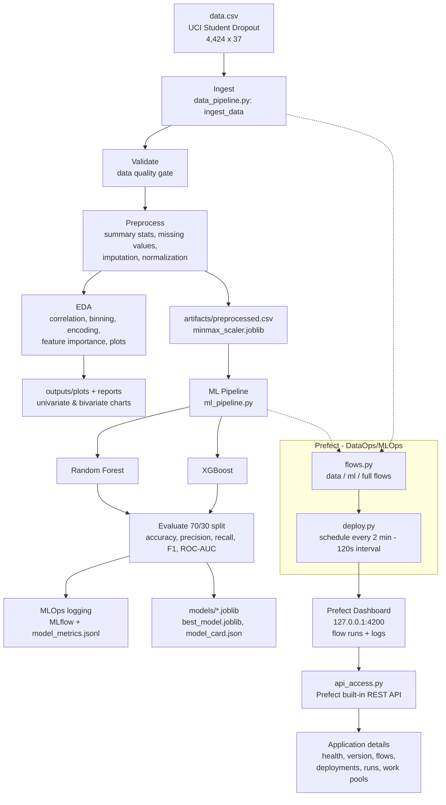

# Student Success Pipeline — End-to-End Reference

A reference document explaining the project end to end. Each section describes what a component
is, why it exists, and the exact command that runs it — kept in the order the pipeline flows so
it can be followed top to bottom.

## 0. Architecture Overview

**Business problem:** predict early whether an enrolled student will **drop out**, using
academic, demographic, and socio-economic attributes recorded at enrollment and after the first
two semesters, so that early intervention is possible.

**Dataset:** UCI *Predict Students' Dropout and Academic Success* — **4,424 rows × 37 columns**
(36 features + 1 target), semicolon-delimited. The 3-class `Target` (Dropout / Enrolled /
Graduate) is reframed as binary: **Dropout = 1** vs **Not-Dropout = 0**.

The diagram below is the overall map of the solution — how raw data becomes a scheduled,
monitored pipeline whose details are accessible through APIs.



Reading the flow: raw data is ingested, validated, preprocessed, and explored (Sub-Objective 1).
The preprocessed data feeds two models — Random Forest and XGBoost — trained on a 70/30 split and
evaluated on multiple metrics with MLOps logging (Sub-Objective 2). Prefect orchestrates every
step as scheduled flows running every 2 minutes, streaming logs to a cloud dashboard (DataOps).
Finally, Prefect's built-in REST API is queried to surface key application details
(Sub-Objective 3).

---

## 1. Prerequisites

The tools required to run every part of the project:

- Python 3.9+
- A Prefect account (for Prefect Cloud) — or the local Prefect server for the dashboard
- The dataset `data.csv`, which lives one level **above** the pipeline folder (`../data.csv`)

Everything runs from the canonical pipeline folder:

```bash
cd "student-success-pipeline"
```

---

## 2. Create a virtual environment and install requirements

```bash
python3 -m venv .venv
source .venv/bin/activate
pip install -r requirements.txt
```

The requirements pin Prefect 3, pandas, numpy, scikit-learn, xgboost, matplotlib, seaborn,
mlflow, and python-docx. An isolated environment keeps the run reproducible.

---

## 3. Sub-Objective 1 — Data Pipeline

A single command runs the full data pipeline: ingest ? validate ? preprocess ? EDA.

```bash
python data_pipeline.py
```

What each stage does, all in `data_pipeline.py`:

- **Ingest** (`ingest_data`) — reads `../data.csv` with `sep=";"`, strips header whitespace ?
  4,424 rows × 37 columns.
- **Validate** (`validate_data`) — a data-quality gate: checks target presence, feature count,
  minimum rows, duplicates, class balance, and outliers; writes
  `outputs/reports/data_quality_report.json`.
- **Preprocess** (`preprocess_data`, step 1.3) — summary statistics
  (`reports/summary_statistics.csv`), missing-value check, data-type breakdown, de-duplication,
  **median imputation** for continuous columns and **mode** for categorical, and **MinMax
  normalization** on continuous columns (scaler saved to `artifacts/minmax_scaler.joblib`).
  Output: `artifacts/preprocessed.csv`.
- **EDA** (`run_eda`, step 1.4) — feature-to-feature and point-biserial **correlation**,
  quartile **binning** of age, target **encoding**, **feature importance** from a quick Random
  Forest, and **5 visualizations** (univariate + bivariate) written to `outputs/plots/`.

The generated outputs can be inspected directly:

```bash
ls outputs/reports/
ls outputs/plots/
```

Key EDA findings: the strongest Dropout-correlated features are 2nd-semester curricular-unit
grade and approvals, 1st-semester grade, and tuition-fees status.

---

## 4. DataOps — scheduled flows every 2 minutes with a cloud dashboard

Orchestration is handled by **Prefect 3**. `flows.py` wraps each pipeline step as a Prefect
`@task` and defines three flows: `data-pipeline`, `ml-pipeline`, and the full
`student-success-pipeline`. `deploy.py` serves these on a **120-second interval schedule**
(every 2 minutes).

Start the local Prefect server (provides the dashboard on port 4200):

```bash
prefect server start
```

In a second terminal, point the client at that server and serve the scheduled deployments:

```bash
prefect config set PREFECT_API_URL=http://127.0.0.1:4200/api
python deploy.py
```

This registers two deployments — `data-pipeline-every-2-min` and `full-pipeline-every-2-min` —
that fire every 2 minutes. Every task uses Prefect's run logger, so **all activity streams to
the dashboard** at http://127.0.0.1:4200 under **Flow Runs ? Logs**, satisfying the requirement
to log all activity and display it on a cloud dashboard.

Prefect Cloud is the hosted alternative: run `prefect cloud login` instead of
`prefect server start`, and the same deployments appear on the Cloud dashboard. The
`prefect.yaml` manifest describes the git-clone-based Cloud deployment to a work pool.

---

## 5. Sub-Objective 2 — Machine Learning Pipeline

```bash
python ml_pipeline.py
```

Implemented in `ml_pipeline.py`:

- **Two algorithms** — Random Forest and XGBoost.
- **Leakage-safe encoding** inside an sklearn `Pipeline` fitted on the train fold only: median
  imputation for continuous features, one-hot encoding for low-cardinality categoricals, and a
  custom Weight-of-Evidence encoder for high-cardinality nominals.
- **70/30 stratified split** (`TEST_SIZE = 0.30`, `RANDOM_STATE = 42`), with `RandomizedSearchCV`
  tuning each model.
- **Evaluation** logs **6 metrics** (exceeds the required 4): accuracy, precision, recall, F1,
  ROC-AUC, and cross-validated F1.

Latest results:

| Model | Accuracy | Precision | Recall | F1 | ROC-AUC |
|---|---|---|---|---|---|
| RandomForest | 0.874 | 0.833 | 0.761 | 0.796 | 0.933 |
| **XGBoost (best)** | **0.885** | **0.857** | **0.771** | **0.811** | **0.938** |

**MLOps logging** — each metric is logged individually (e.g. `[MLOps] XGBoost f1_score = 0.8113`),
confusion-matrix PNGs and per-class classification reports are saved to `outputs/`, and a
timestamped history is appended to `reports/model_metrics.jsonl` +
`reports/model_metrics_latest.json`. Runs are also tracked in **MLflow** (SQLite backend at
`outputs/mlflow.db`, experiment `student-success-dropout`), and the best model is saved to
`models/best_model.joblib` with a `model_card.json`.

The MLflow UI is available for comparing runs:

```bash
mlflow ui --backend-store-uri sqlite:///outputs/mlflow.db
# http://127.0.0.1:5000
```

---

## 6. Sub-Objective 3 — API Access

```bash
python api_access.py
```

`api_access.py` uses **Prefect's built-in REST API** through the Python client
(`get_client()`) to retrieve and display **6 application details** (?4 required):

1. **API health** — `client.api_healthcheck()`
2. **API version** — `client.api_version()`
3. **Registered flows** — `client.read_flows()`
4. **Deployments** — `client.read_deployments()` (name, schedule, tags)
5. **Recent flow runs & states** — `client.read_flow_runs(limit=5)`
6. **Work pools** — `client.read_work_pools()`

This demonstrates accessing application information (flows, deployments, runs) programmatically
via the platform's own APIs. The Prefect server (or Cloud login) must be active and
`PREFECT_API_URL` set for the client to connect.

---

## 7. Generate the submission report (optional)

```bash
python generate_report.py
# ? outputs/reports/Group00_Submission_Report.docx
```

This assembles the summary statistics, correlation and feature-importance tables, model metrics,
and plots into a Word document for submission.

---

## 8. Summary

The end-to-end flow, in one line:

Ingest ? validate ? preprocess ? EDA (Sub-Objective 1) ? Prefect scheduled flows every 2 minutes
with a cloud dashboard (DataOps) ? Random Forest + XGBoost trained 70/30 and evaluated on 6
metrics with MLflow logging (Sub-Objective 2) ? Prefect built-in REST API surfacing key
application details (Sub-Objective 3).

---

## Quick command index

| Stage | Command |
|-------|---------|
| Env | `python3 -m venv .venv && source .venv/bin/activate && pip install -r requirements.txt` |
| Data pipeline | `python data_pipeline.py` |
| Prefect dashboard | `prefect server start` |
| Point client | `prefect config set PREFECT_API_URL=http://127.0.0.1:4200/api` |
| Schedule (every 2 min) | `python deploy.py` |
| ML pipeline | `python ml_pipeline.py` |
| MLflow UI | `mlflow ui --backend-store-uri sqlite:///outputs/mlflow.db` |
| API access | `python api_access.py` |
| Report | `python generate_report.py` |
| Prefect Cloud | `prefect cloud login` (instead of `prefect server start`) |
